<div align="center">
<h3><code>ashmit@github ~ $ ./contributions.sh</code></h3>

<br><br>
<h3><code>ashmit@github ~ $ whoami</code></h3>
<table><tr><td valign="top"></td><td valign="top"></td></tr></table>
<br>
<h3><code>ashmit@github ~ $ ./about.sh</code></h3>
</div>

I'm an **AI/ML student pursuing the path toward AI Engineering**.

I learn by building real systems — especially around **LLMs, RAG, fine-tuning, evaluation, agents, inference, and automation**.

```text
CURRENTLY EXPLORING

→ LLM Engineering
→ RAG & Retrieval
→ Fine-tuning with PEFT / LoRA
→ Efficient inference with vLLM
→ LLM Evaluation / Evals
→ AI Agents
→ AI Automation
```

<div align="center">
<h3><code>ashmit@github ~ $ ./stack.sh</code></h3>

| Area | Tools |
|---|---|
| ML | Machine Learning · TensorFlow |
| LLM | LangChain · RAG · PEFT · LoRA |
| Inference | vLLM |
| Evaluation | LLM Evals |
| Automation | n8n |
| Engineering | Git · Docker |

<h3><code>ashmit@github ~ $ ./projects.sh</code></h3>
**Featured projects will be added here as you ship them.**
<br><br>
<code>build → evaluate → iterate → ship</code>
</div>
